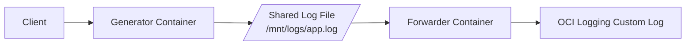
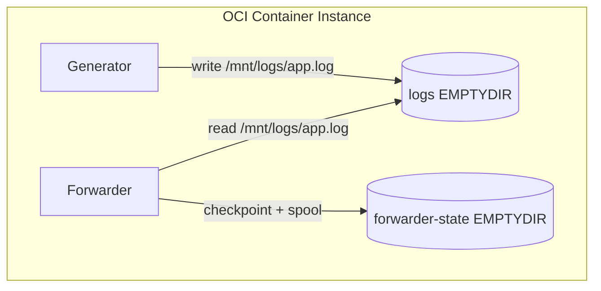
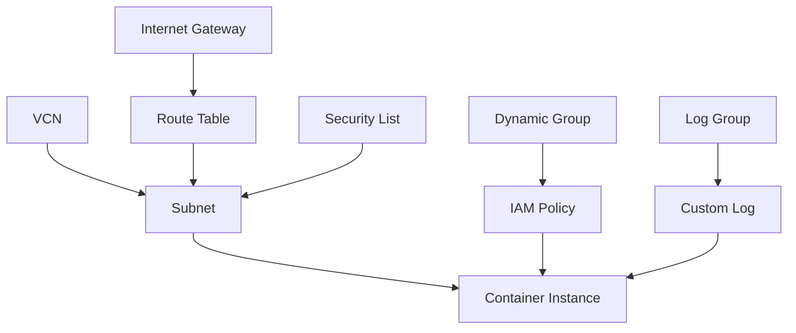
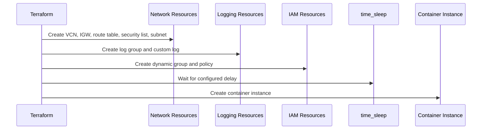
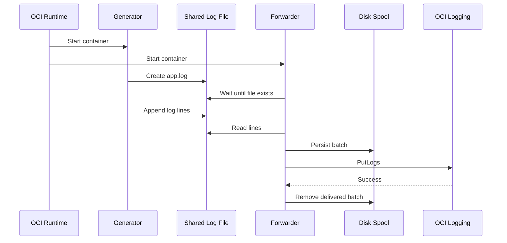

# Understanding This Repository

This document explains the **current** architecture of the repository.

It focuses on what exists today:

- the generator container
- the forwarder container
- the shared storage model
- the OCI resources created by Terraform
- how logs move from a local file into OCI Logging

It does **not** cover older approaches or discarded designs.

---

## 1. Repository Purpose

This repository demonstrates a simple OCI logging pattern:

1. one container writes application logs to a shared file
2. another container reads that file
3. the second container sends those log lines to OCI Logging

The pattern is implemented for **OCI Container Instances** and uses **resource principal authentication** for OCI API access.

---

## 2. Repository Layout

The main directories are:

```text
generator/          HTTP log producer image
forwarder/          OCI log forwarder image
container_instance/ Terraform for OCI infrastructure and runtime
blog/               repository documentation
```

Each directory has a clear role:

- `generator/` produces log lines
- `forwarder/` ships log lines
- `container_instance/` provisions the OCI environment that runs both containers

---

## 3. End-to-End Flow

At a high level, the runtime flow looks like this:

```text
Client --> generator container --> shared log file --> forwarder container --> OCI Logging
```



More concretely:

1. the generator receives an HTTP request
2. it appends a formatted line to `/mnt/logs/app.log`
3. the forwarder waits for that file to exist
4. the forwarder tails the file and any rotated successors
5. the forwarder sends batches to OCI Logging with the OCI Python SDK

---

## 4. Generator Container

The generator is a small HTTP service.

Its responsibilities are:

- create the shared log file
- expose a health endpoint
- accept log-writing requests
- append formatted lines to the shared file

### Endpoints

The generator exposes:

- `GET /health`
- `POST /log`

### Log file ownership

The generator is the component that creates the shared log file.

That is an explicit contract in this repository:

- the **generator creates the file**
- the **forwarder waits for it**

### Example request

```bash
curl -X POST http://<host>:8080/log \
  -H 'Content-Type: application/json' \
  -d '{"level":"INFO","message":"hello"}'
```

That produces a log line in the shared file.

---

## 5. Forwarder Container

The forwarder is responsible for getting local log lines into OCI Logging.

It is built on:

- Oracle Linux 9
- Python 3
- the OCI Python SDK
- `logrotate`

### What the forwarder does

At startup, the forwarder:

1. validates its required environment
2. waits for the generator-created log file
3. prepares the logrotate config
4. starts a background logrotate loop
5. starts the Python shipping process

### What the Python shipper does

The Python shipper:

1. gets a resource principal signer
2. creates an OCI Logging ingestion client
3. tracks the active file and rotated files by inode
4. reads log lines
5. writes pending batches to disk
6. retries `PutLogs` requests until OCI accepts them
7. removes queued batch files only after a successful send

### Authentication model

The forwarder supports **resource principal authentication only**.

That means:

- no mounted OCI config
- no user API keys
- no separate credential file in the container

OCI injects the runtime identity, and IAM policy controls what that identity may do.

---

## 6. Shared Storage Model

The two containers share storage inside the container instance.



### Shared logs volume

Both containers mount the same `EMPTYDIR` volume at `/mnt/logs`.

The generator writes:

```text
/mnt/logs/app.log
```

The forwarder reads that same file.

### Forwarder state volume

The forwarder also mounts a second `EMPTYDIR` volume at:

```text
/var/lib/oci-log-forwarder
```

This volume stores:

- the file read checkpoint
- the on-disk spool of unsent batches

This lets the forwarder survive container restarts within the same container instance without losing everything it had already queued.

---

## 7. Log Rotation Behavior

The repository uses `logrotate` to manage the shared log file.

The active file is rotated by **rename and create**:

1. the current file is renamed
2. a new file is created at the original path

The forwarder tracks files by inode, which allows it to:

- continue draining the rotated file
- switch to the new active file without abandoning unread data from the old inode

This is important because the generator and forwarder run concurrently.

---

## 8. Reliability Model

The forwarder uses an on-disk spool instead of relying only on memory.

That means:

- lines are read from the log file
- queued batches are written to disk
- only then are they considered pending for delivery

If OCI Logging is temporarily unavailable, the forwarder retries.

If the forwarder container restarts, the spool files remain available on the mounted forwarder-state volume.

This gives the system better durability during:

- transient OCI API failures
- forwarder restarts
- bursts of log volume

---

## 9. OCI Resources Created by Terraform

The `container_instance/` directory contains Terraform that provisions the OCI side of the system.



The main resources are:

- VCN
- internet gateway
- route table
- security list
- subnet
- log group
- custom log
- dynamic group
- IAM policy
- container instance

### VCN

The VCN provides the network boundary for the deployment.

### Internet gateway and route table

These provide outbound connectivity so the runtime can:

- reach OCI APIs
- pull container images

### Security list

The security list allows:

- all outbound traffic
- optional inbound access to the generator HTTP port from configured CIDRs

### Subnet

The subnet is where the container instance VNIC is attached.

### Log group and custom log

These are the OCI Logging destination resources.

The forwarder sends log batches to the custom log.

### Dynamic group

The dynamic group identifies the container instance runtime as an IAM principal.

### IAM policy

The IAM policy grants that principal the permissions it needs, including:

- reading container repositories
- sending log content to OCI Logging

### Container instance

The container instance is the runtime resource that launches:

- the generator container
- the forwarder container

It also defines:

- the shape and memory/CPU
- the shared volumes
- the VNIC placement
- the environment variables for both containers

---

## 10. Why There Is a Delay Before Container Creation

Terraform waits before creating the container instance.

The delay exists so that the surrounding resources have time to settle, especially:

- IAM resources
- logging resources

In this repository, the delay is modeled with a `time_sleep` resource before the container instance is created.

---

## 11. Terraform Apply Sequence

When you run Terraform, the sequence is:



1. create the network resources
2. create the log group and custom log
3. create the dynamic group and IAM policy
4. wait for the configured delay period
5. create the container instance

This sequence makes the deployment easier to reason about because all required OCI resources are declared in one place.

---

## 12. Runtime Sequence

After the infrastructure exists, the runtime behavior is:



1. OCI starts the container instance
2. OCI pulls the generator and forwarder images
3. the generator starts and creates the shared log file
4. the forwarder waits until that file exists
5. the generator receives `POST /log` requests and appends lines
6. the forwarder reads those lines and spools them to disk
7. the forwarder sends them to OCI Logging
8. log rotation continues in the background as the file grows

---

## 13. How to Verify Logs Are Reaching OCI Logging

After deployment, the most useful verification approach is to check the system from both ends:

- confirm that the generator is producing log lines
- confirm that the forwarder is shipping them
- confirm that the custom log in OCI Logging is receiving them

### Step 1: Confirm the generator is alive

The generator exposes a health endpoint:

```bash
curl http://<generator-host>:8080/health
```

You should get a JSON response showing:

- `"status": "ok"`
- the configured log file path

That tells you the generator container is running and ready to accept log writes.

### Step 2: Send a known test message

Send a log line with a message that is easy to search for later:

```bash
curl -X POST http://<generator-host>:8080/log \
  -H 'Content-Type: application/json' \
  -d '{"level":"INFO","message":"verification-message-001"}'
```

This gives you a unique marker to look for in OCI Logging.

### Step 3: Check that the shared file is being written

If you have access to the runtime or container logs, verify that:

- the generator accepted the request
- the forwarder started successfully
- the forwarder did not report OCI auth or `PutLogs` errors

Typical forwarder startup signals are:

- it is waiting for or found the shared log file
- it started the OCI log forwarder process
- it is pushing log lines to OCI Logging

### Step 4: Open the custom log in OCI Logging

In the OCI Console, navigate to:

1. **Logging**
2. the log group created by Terraform
3. the custom log used by the forwarder

Open the log search or log explorer view for that custom log.

### Step 5: Search for the exact test message

Search for the unique string you sent, for example:

```text
verification-message-001
```

If the system is working correctly, you should see the log line appear in the custom log.

### Step 6: Verify repeated delivery

Send several messages instead of just one:

```bash
for i in $(seq 1 20); do
  curl -s -X POST http://<generator-host>:8080/log \
    -H 'Content-Type: application/json' \
    -d "{\"level\":\"INFO\",\"message\":\"verification-batch-$i\"}" >/dev/null
done
```

Then confirm that all or nearly all expected messages appear in OCI Logging.

This is a better test than a single message because it exercises:

- repeated file appends
- forwarder batching
- OCI Logging ingestion over several requests

### Step 7: Verify behavior during rotation

To verify that the system still works during rotation:

1. lower the rotation threshold in Terraform or forwarder env
2. generate a larger batch of log lines
3. confirm logs continue appearing in OCI Logging across multiple rotations

This checks the inode-aware rotation handling in the forwarder.

### Step 8: Verify recovery after interruption

To verify the on-disk spool behavior:

1. generate log traffic
2. interrupt or restart the forwarder container
3. allow it to start again
4. confirm that queued messages eventually appear in OCI Logging

This checks that pending batches survive restart on the forwarder-state volume.

### What successful verification looks like

You can consider the pipeline healthy when all of the following are true:

- the generator health endpoint responds
- `POST /log` requests succeed
- the forwarder shows no auth or ingestion errors
- your test messages appear in the OCI custom log
- logs continue to arrive during repeated writes and rotation

### What failure usually means

If logs do not appear in OCI Logging, the most common causes are:

- the generator was never reached
- the forwarder could not obtain a resource principal signer
- IAM policy or dynamic group propagation is not complete yet
- the wrong custom log OCID was injected
- OCI Logging ingestion calls are failing

In practice, checking both the forwarder container output and the custom log search results usually isolates the problem quickly.

---

## 14. How to Think About the System

The simplest way to understand the repository is to split it into three layers.

### Layer 1: log producer

The generator writes log lines to a file.

### Layer 2: log shipper

The forwarder watches that file and sends its contents to OCI Logging.

### Layer 3: OCI infrastructure

Terraform creates the network, identity, logging, and runtime resources needed for the two containers to operate.

That is the core model of the repository.

---

## 15. What a Reader Should Remember

If you want the short version, remember these points:

1. the generator creates and writes the shared log file
2. the forwarder waits for that file and ships its contents
3. the forwarder uses resource principal authentication
4. Terraform provisions both the OCI infrastructure and the container instance runtime
5. the forwarder uses inode-aware rotation handling and an on-disk spool for reliability

That is the current architecture of this repository.
